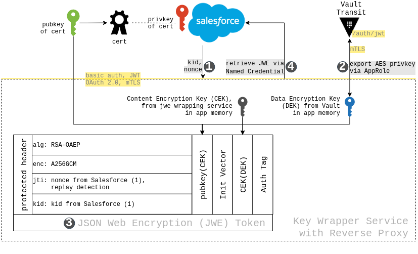

# HYOK-Wrapper
The HYOK Wrapper provides key material, retrieved from a key service, wrapped and in the JWE format ([RFC7516](https://tools.ietf.org/html/rfc7516)), to a key consumer.

Currently supported integrations:
- Key service: Hashicorp Vault
- Key consumer: Salesforce's [Cache-only Key Service](https://help.salesforce.com/articleView?id=security_pe_byok_cache.htm&type=5)

## Setup
### Prerequisites 📚
- `docker-compose` (v3.7+)
- Certificate for key wrapping from Key Consumer
- TLS cert & key for reverse proxy

### HYOK Wrapper
1. Copy certificate for key wrapping to `HYOK-Wrapper/hyok-wrapper/key_consumer_cert.crt`.
2. Install TLS cert & key for reverse proxy:
   1. Copy key to: `HYOK-Wrapper/docker/certs/nginx.key`
   2. Copy cert to: `HYOK-Wrapper/docker/certs/nginx.crt`
3. If you plan to run `HYOK Wrapper` in developer mode, uncomment the following block in `docker-compose.yaml`:
    ```yaml
    vault:
      image: vault:1.5.0
      container_name: vault
      hostname: vault
      restart: always
      cap_add:
        - IPC_LOCK
      environment:
        - VAULT_DEV_ROOT_TOKEN_ID=root          # server config
        - VAULT_DEV_LISTEN_ADDRESS=0.0.0.0:8200 # server config
        - VAULT_ADDR=http://127.0.0.1:8200      # cli config
        - VAULT_TOKEN=root                      # cli config
    ```
    This will deploy Hashicorp Vault using its in-memory database.
  - ⚠️ If you plan to run `HYOK Wrapper` in production, comment that block and configure a production-ready Vault instance.
4. 🛠️ Build docker images: `./00-build.sh`
5. 🚀 Run service: `./01-start.sh`
6. 🔄 (Re-) load config: `./02-load-config.sh`
7. 🛑 Stop service: `./03-stop.sh`
8. 🗑️ Remove service: `./04-remove.sh`

### Vault
- Verify: `docker exec vault vault read transit/keys/salesforce`
- Todo
  - Configure TTL for key in accordance to Salesforce cache-only key policy?
  - Current configuration provides the same key for every request from Salesforce instead of generating a new one each time.
- Test your Vault configuration using the Vault cli:
  - ```bash
    docker exec vault \
      vault read -format=json transit/export/encryption-key/salesforce/latest | \
      jq -r ".data.keys[]" > vault-dek.key.base64
    ```
  - ```bash
    docker exec vault \
      vault write -format=json sys/tools/hash/sha2-256 \
      input=$(cat vault-dek.key.base64) | \
      jq -r ".data.sum" > vault-dek.key.hex
    ```

### Configure Mutual TLS for Salesforce

1. Create CA key:
```bash
openssl genrsa -aes-256-cbc -out myCA.key 4096
```
2. Create CA config (`ca.cfg`):
```bash
[req]
distinguished_name = req_distinguished_name
prompt = no
[req_distinguished_name]
countryName = CH
stateOrProvinceName = ZH
localityName = SomeCity
organizationName = SomeOrg
organizationalUnitName = SomeOrgUnit
commonName = example.com
```
3. Create CA cert:
```bash
openssl req -x509 -new -nodes -key myCA.key -sha512 -days 3650 -out myCA.crt -config ca.cfg
```
4. Verify CA cert:
```bash
openssl x509 -text -noout -in myCA.crt
```
5. Create cert key:
```bash
openssl genrsa -aes-256-cbc -out myCert.key 4096
```
6. Create cert config (`cert.cfg`):
```bash
[req]
distinguished_name = req_distinguished_name
req_extensions = v3_req
prompt = no
[req_distinguished_name]
countryName = CH
stateOrProvinceName = ZH
localityName = SomeCity
organizationName = SomeOrg
organizationalUnitName = SomeOrgUnit
commonName = client.example.com
[v3_req]
keyUsage = critical, digitalSignature, keyAgreement
extendedKeyUsage = serverAuth
subjectAltName = @alt_names
[alt_names]
DNS.1 = client1.example.com
IP.1 = 192.168.1.2
```
7. Create cert csr:
```bash
openssl req -new -sha512 -key myCert.key -config cert.cfg -out myCert.csr
```
8. Verify cert csr:
```bash
openssl req -noout -text -in myCert.csr
```
9. Create cert:
```bash
openssl x509 -req -in myCert.csr -CA myCA.crt -CAkey myCA.key -CAcreateserial -out myCert.crt -days 3650 -sha512 -extfile cert.cfg -extensions 'v3_req'
```
10. Verify cert:
```bash
openssl x509 -text -noout -in myCert.crt
```
11. Verify cert chain:
```bash
openssl verify -CAfile myCA.crt myCert.crt
```

## Usage
Issue an HTTP request against the root directory to retrieve a `jwe` token:
```bash
$ curl -k --no-progress-meter https://127.0.0.1/kid?requestId=nonce | jq
{
  "kid": "kid",
  "jwe": "eyJhbGciOiAiUlNBLU9BRVAiLCAiZW5jIjogIkEyNTZHQ00iLCAia2lkIjogImtpZCIsICJqdGkiOiAibm9uY2UifQ==.NMUv3Kui4-TSQnvKU39vmGPZ8fexJiHck5GPZTboziCy1RzPBUGPeLbP0trGKeRzl9rYQDOoIlNEKYOFSJ6sEF3B2TCprOxSs22q-P3ARrX6fjiPzdwHX09c65W39Ix9xy2aJEejj-lvc2OmNmBp8eMOZO_5z16hDHVfwhdX92Sxdh4-3gHIlI1Cr2ySqYCKUP8XzOPaLyXpq1VKlmaPZeoSkHO8GIU0sJrBXl3dyDc5SfjVIHyMAhM0dM-aiC9OhmaTxmKWDl3hCwsYv2TKyku2GTZvik4cycwUat8C2M2gi9cQsnsed2GpW9NmUW9Q2iVe2hbMZXoWhgn17T8qZ4AbSEZMCDnVKq5vh-i0o3WsN3D_LUPf9PzB1gNUvR5aBhtto69rXNSeacc_pvUAkBo8dug8xh1Jp6ZFNzL88foE_bn1aj7JSV_cCO_yi569MFnOG1eVFH1kD_OtmfUq62OE2hXfjbhBm6A-XrNBzYjxEL1oasmocqaCtWniqDEXy3VQH7trwAMc_5F3tvAkXPeyW35LFPxd5mA4lj2zf6WEq1tlDogbJCF9q8tsRHbUUYSIAidzcXz9aZs1-W5_6IGAthqhPHMULXt59d_UNCmd98RDbUJH-UfOMNi3QItip1rZBp9QPpJzZtDXGJvmffXAsCv6N0C85Ya2P7elP70=.4En4-wR-etKPOaCx.iUW5BCbUiSbQlAOnLZkrkLlbb8kODWt_sSoDTQaEApA=.4otC6CrDbr_hcLcfy3w3xw=="
}

# Check protected header
$ echo "eyJhbGciOiAiUlNBLU9BRVAiLCAiZW5jIjogIkEyNTZHQ00iLCAia2lkIjogImtpZCIsICJqdGkiOiAibm9uY2UifQ==" | base64 -d
{"alg": "RSA-OAEP", "enc": "A256GCM", "kid": "kid", "jti": "nonce"}
```

A `cek` and `jwe token` will be created for every HTTP request.

### Development
Sync code to the `hyok-wrapper` container by executing `./dev/cp_src_docker.sh`. The HTTP server (`gunicorn`) will automatically detect new files and reload them.

## Architecture


## Key Consumer Setup
### Salesforce
- Get a developer account: https://developer.salesforce.com/signup
- Configure `My Domain`: https://help.salesforce.com/articleView?id=domain_name_overview.htm&type=5
- Configure permission for Key Management: https://trailhead.salesforce.com/en/content/learn/modules/spe_admins/spe_admins_set_up
- Create Tenant Secret: https://help.salesforce.com/articleView?id=security_pe_ui_setup.htm&type=5
- How to configure HYOK (a.k.a Cache-only key connection): https://help.salesforce.com/articleView?id=security_pe_byok_cache_callout.htm&type=5
- Configure mutual TLS: https://help.salesforce.com/articleView?id=security_keys_uploading_mutual_auth_cert.htm&type=5
- Troubleshoot: https://help.salesforce.com/articleView?id=security_pe_byok_cache_troubleshoot.htm&type=53

## Further reading
- Salesforce HYOK format specification: https://help.salesforce.com/articleView?id=security_pe_byok_cache_create.htm&type=5
- Salesforce key wrapper example: https://github.com/forcedotcom/CacheOnlyKeyWrapper
- JWE libs (not used in `HYOK Wrapper`)
  - `pyjwkest`: https://github.com/rohe/pyjwkest
  - `Authlib`: https://docs.authlib.org/en/stable/jose/jwe.html
